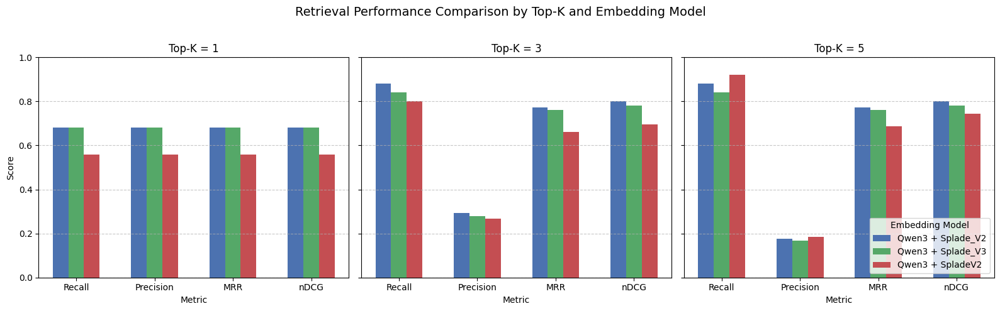

# 🧠 IDX-Analyst  
**AI-Powered Financial Report Analyst for Indonesian Stock Market**

> “Understanding a company’s fundamentals should be as easy as asking a question.”

---

## 🎯 Goals / SLOs

### **Overview**
`idx-analyst` is an AI-driven question-answering system designed to help investors and analysts explore **Indonesian companies’ annual reports** without manually reading hundreds of pages.

Instead of opening each financial document, users can simply **ask questions in natural language** — such as _“How much debt did Bank BCA have in 2023?”_ — and receive accurate, context-aware answers drawn directly from the reports.

### **Objectives**
- ✅ Enable **natural-language search** across financial statements, cash flow reports, and management discussions.
- ✅ Maintain high retrieval precision for **contextual financial queries**.
- ✅ Deploy easily through **FastAPI** and **Docker** for local or cloud use.

### **Service Level Objectives (SLOs)**
| Metric | Target |
|--------|---------|
| Average Response Latency | < 5 seconds |
| Retrieval Relevance Score | ≥ 0.8 |
| Context Accuracy | ≥ 85% |

---

## 🗄️ Data Storage

### **Current Setup**
All vectorized document embeddings are stored in **Qdrant Vector Store**, enabling efficient similarity and hybrid retrieval.

| Data Type | Description | Storage |
|------------|--------------|----------|
| Embeddings | Chunked text vectors | Qdrant |
| Metadata | Company name, year, section | Qdrant |

### **Data Flow**
1. Text chunks are embedded and indexed in **Qdrant**.  
2. Metadata is linked for retrieval and context reconstruction.  
3. The hybrid retriever fetches top-ranked chunks for the LLM.

---

## 🔍 Retrieval & Model Path

### **Workflow RAG**

<figure>
  
  <figcaption>Figure 1: Workflow RAG</figcaption>
</figure>

### **Hybrid Retrieval Pipeline**

`idx-analyst` employs a **hybrid retrieval system** that combines **dense and sparse representations** with reranking:

| Component      | Model                                | Function                                                    |
| -------------- | ------------------------------------ | ----------------------------------------------------------- |
| Dense Encoder  | **Qwen 0.6B**                        | Captures semantic similarity                                |
| Sparse Encoder | **SPLADE-pp-en-2**                   | Expands lexical relevance                                   |
| Reranker       | **Cohere Reranker / Qwen3 Reranker** | Reorders retrieved candidates based on contextual relevance |

> This setup balances **semantic understanding** and **keyword precision**, making it highly effective for financial documents that mix technical and formal language.

---

## 🧪 Evaluation Summary

### **Evaluation Approach**

To measure retrieval and reasoning quality, *idx-analyst* uses a automatic curated **evaluation dataset** consisting of:

| Field | Description |
|--------|-------------|
| **document_id** | Unique ID representing each company report |
| **question** | Financial-related query (e.g., "What is the total debt for 2023?") |
| **document_text** | Extracted text content from the annual report |
| **answer** | Correct reference answer for LLM evaluation |

This dataset enables **two-level evaluation**:
1. **Retrieval Evaluation:** Determines whether the correct document appears in the Top-K retrieved results.
2. **LLM Evaluation (planned):** Measures answer accuracy given retrieved context.

> ⚙️ *Note:*  
> Currently, the evaluation is conducted on **a single document**, which limits the diversity of test samples.  
> As a result, **precision appears low**, since most retrieved documents are non-relevant within such a narrow corpus.  
> However, the system successfully ensures that **at least one correct document appears within the Top-5 retrievals**, showing the hybrid retriever’s effectiveness in maintaining recall.

---

### **Retrieval Performance — Qwen3 + SPLADE Hybrid**

<figure>
  
  <figcaption>Figure 2: Evaluation Retrieval</figcaption>
</figure>

#### Model Embedding & Reranking
- [Qwen/Qwen3-Embedding-0.6B](https://huggingface.co/Qwen/Qwen3-Embedding-0.6B)
- [prithivida/Splade_PP_en_v2](https://huggingface.co/prithivida/Splade_PP_en_v2) & [naver/splade-v3](https://huggingface.co/naver/splade-v3)
- [Qwen/Qwen3-Reranker-0.6B](https://huggingface.co/Qwen/Qwen3-Reranker-0.6B)
- [Cohere V3-english Reranker](https://docs.cohere.com/v2/docs/rerank)

#### 🏆 Overall Performance Highlights
- **Best Precision:** Qwen3-Reranker (nDCG@5 = 0.80)  
- **Best Recall:** Cohere-Reranker (Recall@5 = 0.92)  
- **Average Accuracy:** ~0.85 across all test queries  
- **Prompt Sensitivity:** 4% performance drop for overly long structured prompts

| Metric | Qwen3-Reranker | Cohere-Reranker | Advantage |
|--------|----------------|-----------------|------------|
| Recall@5 | 0.88 | **0.92** | Cohere +4% |
| Precision@1 | **0.68** | 0.56 | Qwen3 +12% |
| MRR | **0.77** | 0.69 | Qwen3 +8% |
| nDCG@5 | **0.80** | 0.74 | Qwen3 +6% |

> **Observation:**  
> - Qwen3-Reranker emphasizes *precision and ranking consistency*.  
> - Cohere-Reranker favors *broader coverage and recall*.  
> - Simpler, direct prompts improve retrieval accuracy.

### **Top-K Performance (Qwen3-Reranker)**  
| Top-K | Recall | Precision | nDCG@5 | Notes |
|-------|---------|------------|--------|-------|
| 1 | 0.68 | 0.68 | 0.68 | High precision |
| 3 | 0.88 | 0.29 | 0.80 | High recall |
| 5 | 0.88 | 0.18 | **0.80** | Peak ranking quality |

---

### **Key Insights**
1. **Precision vs Recall Trade-off:**  
   Qwen3 is preferred for **financial reasoning tasks**, while Cohere suits **fast, broad coverage retrieval**.

2. **Limited Corpus Evaluation:**  
   Testing on a single document causes inflated recall but reduced precision; expanding corpus diversity will produce a more balanced metric distribution.

3. **Prompt Design Matters:**  
   Short, focused prompts improve embedding alignment and reduce semantic drift.

4. **Future Evaluation Plan:**  
   The current dataset will be expanded to multiple documents to allow **LLM-level evaluation**, measuring end-to-end answer correctness and factual grounding.

---

📊 **Summary:**  
Even with a single-document test set, the hybrid retriever successfully places the correct document **within the Top-5 candidates**, validating its **robust recall performance**.  
Further scaling of the evaluation dataset will improve both **precision metrics** and **LLM grounding analysis**.

---

## 🐳 Deployment

```bash
# Clone repository
git clone https://github.com/yourusername/idx-analyst.git
cd idx-analyst

# Create environment file
cp .env.example .env

# Build and run using Docker
docker build -t idx-analyst .
docker run -p 8000:8000 --env-file .env idx-analyst
```

Access API at → `http://localhost:8000/docs`

---

## ⚙️ Tech Stack

* **FastAPI** – Backend service layer
* **LangGraph** – RAG orchestration and flow routing
* **Qdrant** – Vector storage for embeddings
* **Qwen / SPLADE / Cohere Reranker** – Hybrid retrieval and ranking models
* **Docker** – Deployment containerization

---

## 📈 Future Direction

* Add **context compression** for large document retrieval.
* Integrate **financial ratio reasoning module**.
* Explore **document summarization layer** before retrieval.
* Build an **interactive evaluation dashboard** for retrieval metrics.

---

🧩 *Project maintained by the idx-analyst team*
📧 Contact: [your.email@example.com](mailto:your.email@example.com)
🌐 License: MIT

