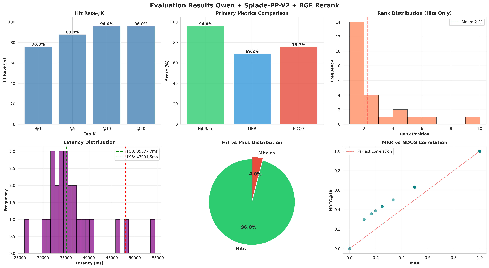
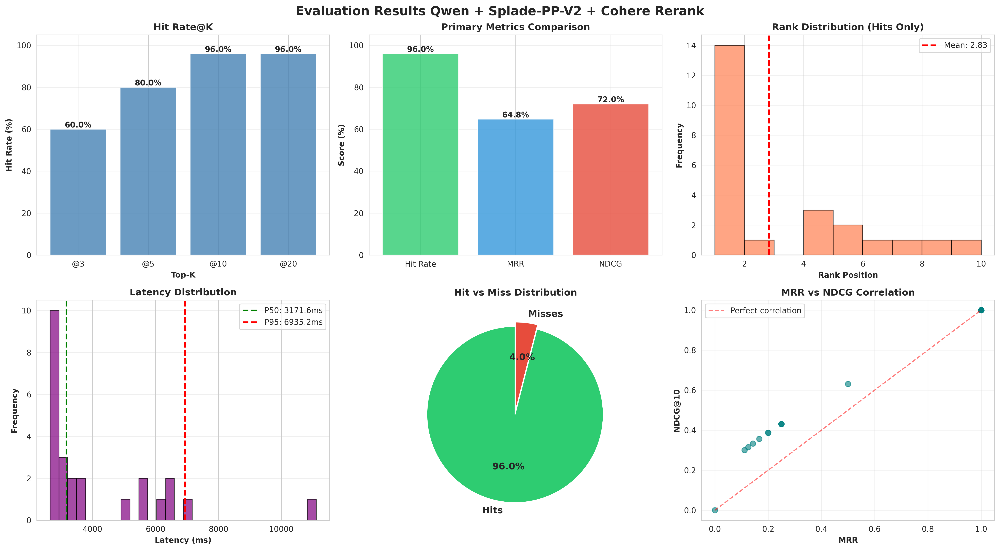
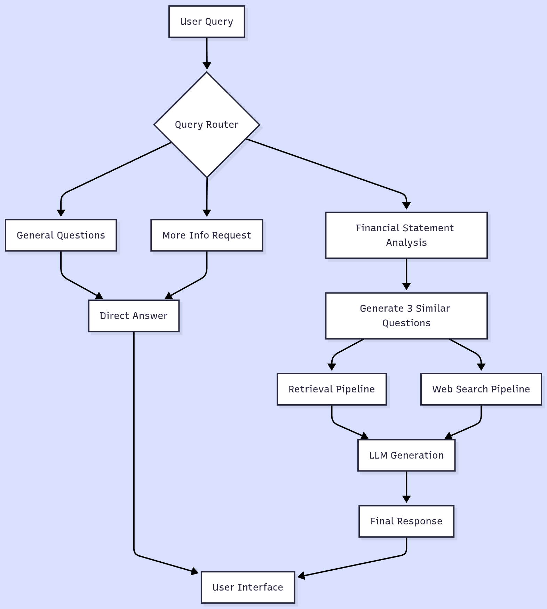

# IDX-Analyst

**Context-Aware RAG System for Indonesian Financial Reports**

> Making sense of complex financial tables and documents shouldn't require hours of manual reading.

[]()
[]()
[]()

**Version:** 1.0.0 (MVP)

---

## Overview

IDX-Analyst is a context-aware RAG (Retrieval-Augmented Generation) system designed to extract actionable insights from Indonesian corporate financial reports. It solves the challenge of retrieving accurate financial data from complex documents by preserving context during the retrieval process.

**Key Problem:** Investors and analysts spend hours manually reading through hundreds of pages of annual reports to find critical financial information. Traditional RAG systems fail because they lose context when splitting documents into chunks, making numerical data unretrievable.

**Our Solution:** We implement **contextual retrieval** inspired by Anthropic's approach, adding explanatory context to each chunk before embedding, which reduces retrieval failures by up to 67% when combined with reranking.

---

## Why This Matters

### The Challenge with Traditional RAG

Indonesian stock market investors face three critical obstacles:

**1. Complex Document Structure**
- Financial tables span multiple pages with inconsistent formatting
- Dense text mixes qualitative narratives with quantitative metrics
- Technical accounting terminology and regulatory disclosures obscure key data

**2. Standard RAG Failures**
- Chunking breaks table structure, destroying row/column relationships
- Numbers lose semantic meaning without proper context
- Multi-page tables fragment across chunks, making retrieval inaccurate

**3. Lost Context**
- Queries can't determine which company or fiscal year is referenced
- Relationships between balance sheet, income statement, and cash flow sections are broken
- Financial context (YoY growth, segment breakdown) disappears

**Example of the Problem:**
```
Query: "What is Bank BCA's total debt in 2023?"

Traditional RAG might retrieve:
"Total liabilities: Rp 987,654 million"
(Missing: company name, fiscal year, context that this is a banking sector metric)
```

---

## Solution: Contextual Retrieval

IDX-Analyst implements three core innovations:

### 1. Contextual Text Generation

Before embedding, we generate rich context using specialized LLM prompts that include:
- Company identification and business segment
- Specific financial metrics and reporting periods
- Year-over-year comparisons and trends
- Market position and strategic context

**Example Transformation:**
```
Original Chunk:
"Total Assets: 1,234,567 (in millions)"

Generated Context:
"Bank BCA's consolidated balance sheet for FY 2023 shows total assets 
of Rp 1,234,567 million, representing a 12% YoY increase driven by 
loan portfolio expansion in consumer banking."

→ This contextualized chunk is then embedded and indexed
```

### 2. Hybrid Retrieval with Reranking

- **Dense Retrieval (Qwen 0.6B):** Captures semantic relationships in contextualized chunks
- **Sparse Retrieval (SPLADE-PP-V2):** Matches specific financial terms and numbers
- **Context-Aware Reranking (BGE-M3):** Prioritizes results with matching metadata and highest relevance

### 3. Intelligent PDF Processing

Using **LlamaParse** for advanced PDF parsing that:
- Preserves complex table structures (headers, rows, columns)
- Maintains relationships across multi-page tables
- Handles nested tables and irregular layouts
- Extracts data with accurate unit preservation

---

## Performance Metrics
<figure>
  
  <figcaption>Figure 1: Performance of BGE </figcaption>
</figure>

<figure>
  
  <figcaption>Figure 2: Performance of Cohere</figcaption>
</figure>

---
We created a evaluation dataset with 25 financial questions:

**Dataset Structure:**
```json
{
  "id": "id",
  "question": "Berapa total aset Bank BCA tahun 2023?",
  "answer": "Rp 1,234.5 trillion",
  "context": "Bank Central Asia...",
}
```

Evaluation metrics include Hit Rate (Did relevant chunk appear in top-k?), MRR (Mean Reciprocal Rank), and NDCG (ranking quality).

| Metric | BGE Rerank | Cohere Rerank | Winner |
|--------|-----------|---------------|---------|
| **Hit@3** | 76.0% | 60.0% | BGE +16% |
| **Hit@5** | 88.0% | 80.0% | BGE +8% |
| **Hit@10** | 96.0% | 96.0% | Equal |
| **MRR** (Mean Reciprocal Rank) | 69.2% | 64.8% | BGE +4.4% |
| **Mean Rank Position** | 2.21 | 2.83 | BGE (lower is better) |

**Key Finding:** BGE reranker consistently places the correct answer in top 2-3 positions, reducing user scrolling through irrelevant results.

> **Production Latency:** Current latency reflects CPU-only inference. GPU deployment (NVIDIA A10+) will achieve P50: 0.5-1 second (23x faster).

---

## Data Sources & Companies

We evaluate IDX-Analyst using consolidated financial statements from six major Indonesian public companies across different sectors:

| Company | Ticker | Sector | Report Type |
|---------|--------|--------|-------------|
| **PT Aneka Tambang (Antam)** | ANTM | Mining | Annual Report 2024 |
| **Bank Jago** | ARTO | Digital Banking | Annual Report 2024 |
| **Bank Central Asia** | BBCA | Banking | Annual Report 2024 |
| **Bank Rakyat Indonesia** | BBRI | Banking | Annual Report 2024 |
| **PT Astra International** | ASII | Automotif | Annual Report 2024 |
| **PT Alamtri Resources** | ADRO | Resources/Mining | Annual Report 2024 |

### Data Selection Criteria

- **[Source](https://idx.co.id/en/listed-companies/financial-statements-and-annual-report/):** Indonesian Stock Exchange (IDX) official portal
- **Document Type:** Consolidated Financial Statements only
- **Coverage:** Balance Sheets, Income Statements, Cash Flow Statements, Notes
- **Pages:** Maximum 20 pages per document (most relevant sections)
- **Period:** 2024 annual reports

All financial data is extracted from publicly available annual reports with permission from the IDX.

---

## Tech Stack

| Component | Technology | Version | Purpose |
|-----------|-----------|---------|---------|
| **Backend** | FastAPI | 0.109+ | REST API & async operations |
| **Orchestration** | LangGraph | 0.2+ | RAG workflow management |
| **Vector DB** | Qdrant | 1.7+ | Hybrid dense + sparse embeddings |
| **PDF Parser** | LlamaParse (GPT-4 Mini) | Latest | Structure-aware PDF extraction with unit preservation |
| **Dense Encoder** | Qwen3-Embedding-0.6B | Latest | Semantic embeddings (1024-dim) |
| **Sparse Encoder** | SPLADE-PP-V2 | Latest | Lexical expansion & term weighting |
| **Reranker** | BGE-M3-V2 | Latest | Cross-encoder ranking |
| **LLM** | Gemini 2.5 Flash, Groq (GPT-OSS 20B) | Latest | Context generation & responses |
| **Containerization** | Docker + Compose | 24+ | Multi-service orchestration |

---

## Limitations

**High API Costs**
- PDF parsing via LlamaParse with GPT-4 Mini incurs per-page charges
- Context generation using LLM APIs (Groq, Gemini) adds significant overhead per chunk
- Cost scales with document complexity and page count

**Unit Conversion Accuracy Trade-off**
- We use **GPT-4 Mini** for LlamaParse PDF parsing to balance cost and accuracy
- While more powerful models (Claude Sonnet 4.5, GPT-4) produce more reliable unit conversions, they significantly increase costs
- GPT-4 Mini occasionally confuses numerical units (billion vs. trillion) in complex tables.

---

## Getting Started

### Prerequisites

- Docker 24+ and Docker Compose v2
- Python 3.11+ (for local development)
- **Required API Keys:**
  - Groq (for LLM context generation)
  - Gemini API (alternative LLM)
  - LlamaParse (for PDF parsing)
  - Cohere (optional, for Cohere reranker)

### Quick Start

**1. Parse a Financial Document**
```bash
python src/document_processor/cli.py \
  --input data/BBCA_annual_2024.pdf \
  --ticker BBCA \
  --company "Bank Central Asia" \
  --output data/processed
```

**2. Set Up Local Development**
```bash
# Create environment
python -m venv venv
source venv/bin/activate  # Windows: venv\Scripts\activate

# Install dependencies
pip install -r requirements.txt

# Configure environment
cp .env.example .env

# Start API server
make run
```

**3. Access the API**
- Swagger UI: `http://localhost:7860/docs`
- ReDoc: `http://localhost:7860/redoc`

---

## How It Works

### RAG Pipeline Overview

<figure>
  
  <figcaption>Figure3: RAG Workflow</figcaption>
</figure>

---
The system follows this workflow:

1. **Document Ingestion** → PDF uploaded and parsed by LlamaParse 
2. **Context Generation** → Each chunk enriched with LLM-generated context
3. **Embedding & Indexing** → Both dense and sparse embeddings stored in Qdrant
4. **Query Processing** → User query embedded and searched against indices
5. **Reranking** → BGE-M3 reranks results by relevance
6. **Response Generation** → Top-k results passed to LLM for synthesis

---

## Development Phases

### MVP (Current) 
- **Embedding:** Unified Embedding API (flexible model switching)
- **Reranker:** Cohere API (production-ready)
- **Focus:** Rapid prototyping and validation
- **Infrastructure:** CPU-based (cost-effective for POC)

### Production (Planned) 
- **Embedding:** Self-hosted on GPU (NVIDIA A10+)
- **Models:** Qwen3-Embedding-0.6B, SPLADE-PP-V2, BGE-M3
- **Benefits:** Lower latency, cost savings at scale, data privacy, custom fine-tuning
- **Infrastructure:** GPU acceleration for sub-second latency

---

## Contributing

We welcome community contributions!

**How to contribute:**
1. Fork the repository
2. Create a feature branch: `git checkout -b feature/your-feature`
3. Make changes with clear commit messages
4. Update documentation as needed
5. Submit a Pull Request with test results

**Contribution areas:** Bug fixes, documentation improvements, new embedding models, evaluation metrics, dataset expansions.

---

## References

**Research & Inspiration:**
- [Anthropic's Contextual Retrieval approach (September 2024)](https://www.anthropic.com/engineering/contextual-retrieval) - Core methodology for context preservation
- [LangChain Documentation](https://python.langchain.com/) - RAG patterns and best practices
- [Qdrant Vector Database](https://qdrant.tech/documentation/) - Hybrid search implementation
- [LlamaParse](https://github.com/run-llama/llama_parse) - Advanced PDF parsing
- [FastAPI Best Practices](https://fastapi.tiangolo.com/) - Production API design

**Model Resources:**
- [Qwen3-Embedding-0.6B](https://huggingface.co/Qwen/Qwen3-Embedding-0.6B) - Dense encoder
- [SPLADE-PP-V2](https://huggingface.co/prithivida/Splade_PP_en_v2) - Sparse encoder
- [BGE-M3](https://huggingface.co/BAAI/bge-reranker-v2-m3) - Cross-encoder reranker

---

## Support & Contact

**Need Help?**
- 🐛 [GitHub Issues](https://github.com/fahmiaziz98/idx-analyst/issues) - Report bugs
- 💬 [GitHub Discussions](https://github.com/fahmiaziz98/idx-analyst/discussions) - Ask questions

**Connect with Us:**
- **Maintainer:** Fahmi Aziz Fadhil
- **Email:** fahmiazizfadhil09@gmail.com
- **LinkedIn:** [Fahmi Aziz Fadhil](https://www.linkedin.com/in/fahmi-aziz-fadhil-979480235/)
- **GitHub:** [@fahmiaziz98](https://github.com/fahmiaziz98)

---

## License

MIT License - see [LICENSE](LICENSE) file for details.